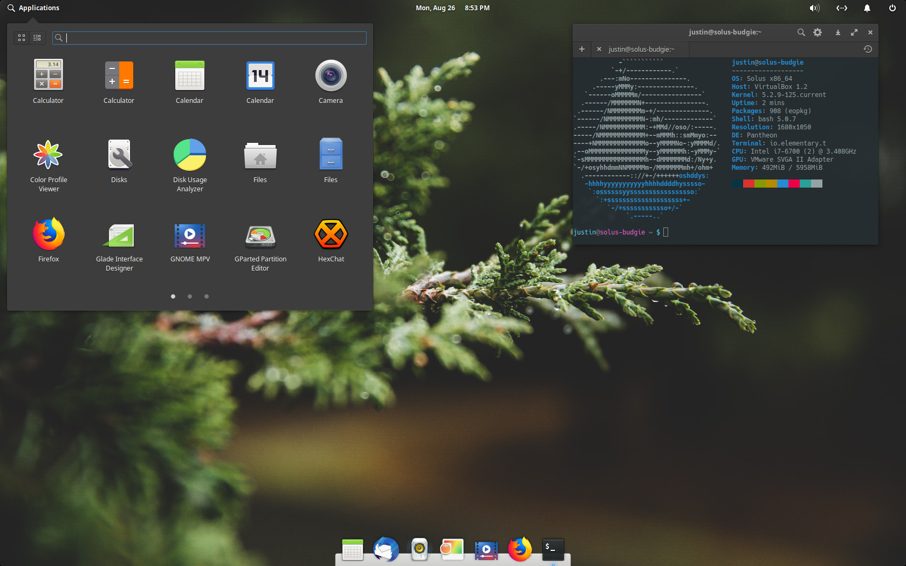

# Pantheon Desktop



## Installation

The whole component can be easily installed using `-c` component switch offered by `eopkg`:

```bash
eopkg it -c desktop.pantheon
```

You can obviously adopt the same approach to uninstall it.

## FAQs

### Locking the screen does not work

If you try to lock the screen and nothing happens, and you noticed this error message in the Journal:

```text
io.elementary.cerbere.desktop[X]: GDBus.Error:org.freedesktop.DBus.Error.ServiceUnknown: The name org.freedesktop.ScreenSaver was not provided by any .service files
```

Then this seems to be caused by another package \(a leftover from the other desktop environment you had installed before Pantheon?\) which is overriding some Pantheon packages configurations. In my case, it seems to be `gnome-screensaver`'s fault. A straightforward package removal has been enough:

```bash
eopkg rm gnome-screensaver
```

