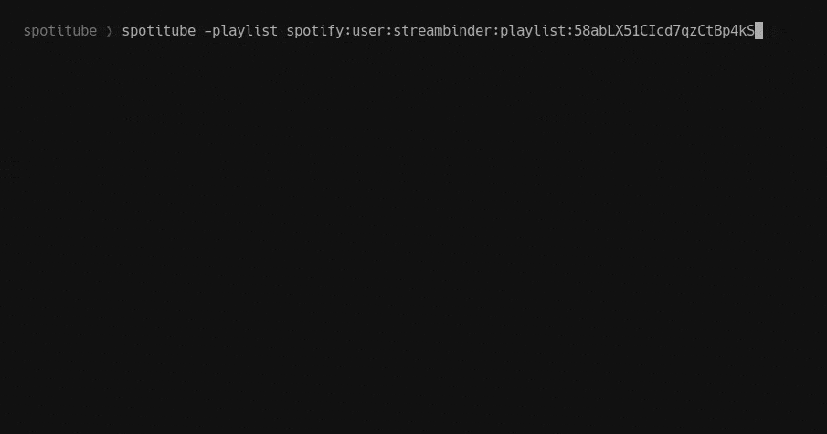

# About

Impressive description apart, Spotitube is a CLI application to programmatically authenticate to your Spotify account, fetch some music and download the best YouTube results for it, keeping playlists files, metadata informations, album artworks, songs lyrics and maximizing _mp3_ files quality.

