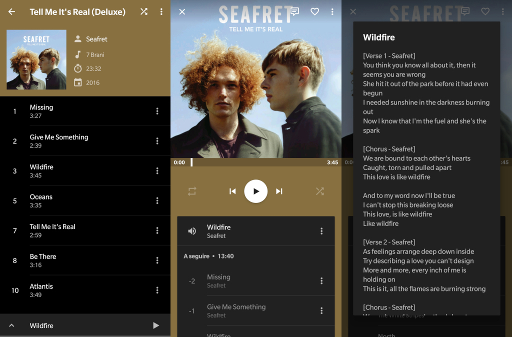

# Engineering

## Execution phases

The solution I wrote to automate the process is covered by three major components:

1. _Spotify_

   This component, once authenticated, is used to keep track of the music to synchronize \(both via library or a playlist\) and as database for the metadata to apply to every downloaded _mp3_.

2. _YouTube_:

   This one is our free music shop, used to be queried to give us the best video it owns about the songs we're looking for. Once found, that one gets downloaded using a combination of `youtube-dl` and `ffmpeg` commands.

3. Lyrics provider \(_Genius_ or _lyrics.ovh_\):

   You will go through this component if you'll enable automatic songs lyrics fetch: _Spotify_ informations about song will be used to find lyrics provided by two entities: _Genius_ and, eventually, if the first one doesn't own it, _lyrics.ovh_.

## Reliability

Several tests got made during the drawing up of the application and now I can say its pretty good at choosing the right song out of a list of keywords \(such as the title and the user of any _YouTube_ video\).

### Latest statistics

Latest verified statistics describes a sample of 396 songs, cumulative of different musical genres: _rock_, _pop_, _disco_ - _house_, _dubstep_ and _remixes_ -, _chamber music_, _soundtrack_, _folk_, _indie_, _punk_, and many others. Also, they belonged to several decades, with songs from 1975 or up to 2017. They were produced by many and very different artists, such as _Kodaline_, _Don Diablo_, _OneRepublic_, _The Cinematic Orchestra_, _Sigur Ros_, _Rooney_, _Royal Blood_, _Antonello Venditti_, _Skrillex_, _Savant_, _Knife Party_, _Yann Tiersen_, _Celine Dion_, _The Lumineers_, _alt-J_, _Mumford & Sons_, _Patrick Park_, _Jake Bugg_, _About Wayne_, _Arctic Monkeys_, _The Offspring_, _Maitre Gims_, _Thegiornalisti_, _Glee_ cast, _One Direction_, _Baustelle_, _Kaleo_, _La La Land_ cast, and many, many more.

The result of `spotitube` execution:

| Type | Quantity \(of 396\) |
| :--- | :--- |
| Songs _not found_ | **13** |
| Found, but _wrong_ | **22** |
| Found, and _right_ | **361** |

In other words, we could say `spotitube` behaved as it was expected to both for _songs not found_ and _found, and right_. In fact, in the first case, the greatest part of the _not found_ songs were actually really not found on _YouTube_.

| Type | Percentage |
| :--- | :--- |
| Success | **95%** |
| Failure | **5%** |

#### Getting always better

The code can surely be taught to behave always better, but there will always be a small percentage of failures, caused by the _YouTube_ users/uploaders, which are unable to specify what a video actually is containing and synthesize it in a title that is not ambiguous \(I'm thinking about, for example, the case of a really talented teenager who posts his first cover video, without specifying that it actually is a cover\). The more you'll get involved on improve `spotitube`, the more you'll notice how lot of things are ambigous and thinking of a way to workaround this ambiguity would bring the project to be too much selective, losing useful results.

