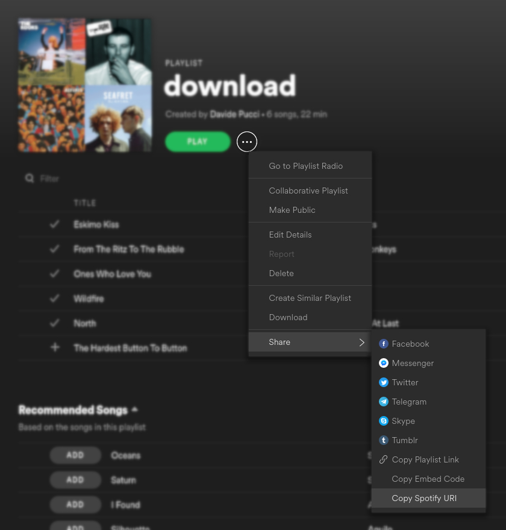

# FAQ

## **How to pull out URI from playlist**



## **Empty or not recognized playlists on Android**

Android delegates the indexing of every media file stored into internal/external storage to a service called MediaScanner, which gets executed to find any new or deprecated file and to update a database filled with all those entries, MediaStore. This is basically done to let every app be faster to find files on storage, relying on this service rather than on specific implementations.

In few cases, some issues got encountered while testing SpotiTube generated playlists, recognized as empty on Android. After some investigations, it seems that MediaScanner defers the `.m3u` \(playlist file\) - the same with `.pls` file - effective parsing, in a actually not understood way: it immediately find the physical playlist file, but its informations will never be parsed.

A simple workaround for the ones experiencing this kind of issues, is to run this shell snippet:

```text
adb shell "am broadcast -a android.intent.action.MEDIA_SCANNER_SCAN_FILE \
	-d file:///sdcard/path/to/playlist/file"
sleep 5
adb reboot
```

